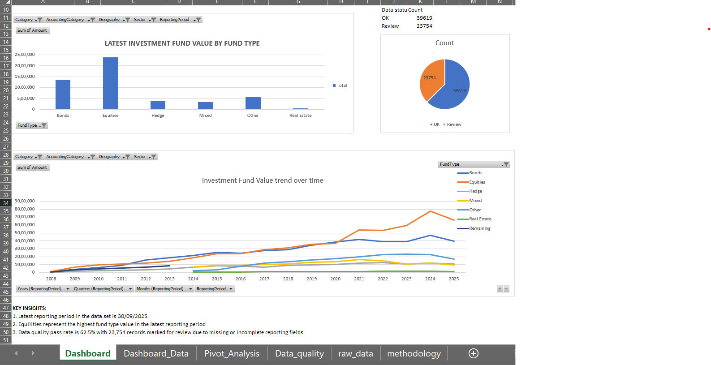

# irish-investment-funds-reporting-dashboard
Excel dashboard analysing Irish resident investment fund statistics with KPI reporting and data quality checks
## Project Overview
This project analyses Irish resident investment fund statistics using Microsoft Excel. The dashboard provides a reporting view of fund values, fund type trends, and data quality status using official Central Bank of Ireland investment funds data.

The project is designed to simulate a finance/reporting workflow where data accuracy, completeness checks, KPI monitoring, and clear dashboard presentation are important.

## Tools Used
- Microsoft Excel
- Pivot Tables
- Pivot Charts
- Excel formulas
- KPI cards
- Data quality checks
- Dashboard formatting

## Key Features
- Latest reporting period KPI
- Total latest fund value
- Highest fund type by value
- Number of fund types
- Data quality pass rate
- Records marked for review
- Fund value analysis by fund type
- Investment fund value trend over time
- Data quality status chart

## Dataset
Source: Central Bank of Ireland - Irish Resident Investment Funds Statistics

The dataset includes quarterly Irish resident investment fund statistics with fields such as reporting period, fund type, accounting category, geography, sector, description, and amount.

## Dashboard Preview

## Key Insights
- The latest reporting period in the dataset is 30/09/2025.
- Equities represent the highest fund type value in the latest reporting period.
- The data quality pass rate is 62.5%, with records marked for review where key reporting fields or amount values are missing.

## Excel Skills Demonstrated
- Data cleaning
- Pivot Table analysis
- Pivot Chart creation
- KPI reporting
- Data quality validation
- Dashboard design
- Financial reporting-style analysis

## Project Relevance
This project is relevant to data analysts, reporting analysts, regulatory reporting, and asset management operations roles. It demonstrates the ability to work with structured financial data, perform quality checks, summarise KPIs, and present insights clearly in Excel.
